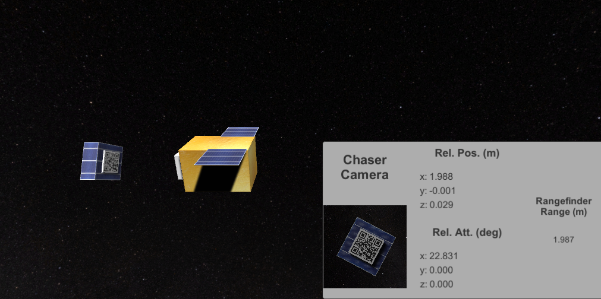

ELSA-d-Simulation
===============

## Developer

Nat Guy (natguy@jpl.nasa.gov)

## Overview

This project is an orbital rendezous visualization and simulation suite, with a flight simulation component and a ground system component, which talk together bidirectionally. The simulation renders two spacecraft with randomized initial torques and linear forces, which causes them to move slightly relative to each other. A simulated camera on the *Chaser* spacecraft produces an image of the *Target* spacecraft.

This simulated camera image is sent over the network to a ground server, which processes this data and looks for a QR code marker. If this marker is seen, it uses the marker to estimate the position and attitude of the *Chaser* relative to the *Target*. The ground server then sends these estimates back to the flight/simulation component, which displays them in a dashboard. (This data could be imagined to be ingested by the flight computer, and perhaps fed into a PID controller which could correct the position and attitude using calculated thrusts with the propulsion system.) The ground server also saves all of the images that it receives over the network.

A screenshot of the flight simulation component is shown below:



In this screenshot, the *Chaser Camera* is showing a virtual camera image. *Rel. Pos.* and *Rel. Att.* are based on an analysis of this camera image by the ground system. The *Rangefinder Range* is calculated directly within the simulation component for comparison and verification of the results.

## Sample Video

[YouTube link](https://youtu.be/WW_zD3agx34)

## Dependencies

The simulation component of this project uses the [Unity Game Engine](https://unity3d.com/) (version 2017.1.3f1 at the time of this writing). Getting it running should be straightforward after you install this version of Unity.

The ground component is a bit more complicated, and requires that these Python modules, along with any accompanying C libraries:

* Flask
* PIL
* zbar
* OpenCV2
* numpy

Getting some of these working (especially zbar) can be a pain and may require building packages from source.

## How to Run

After installing the aforementioned dependencies, the ground server can be brought up by running Flask in the `ground_server` directory:

```
cd ground_server
python flask_server.py
```

This will launch a server which waits for image data from the *flight_and_sim* simulation.

The Unity project in the `flight_and_sim/Chaser` directory can be run within the Unity Editor, or built as an executable package first and then run. Make sure that you edit the `groundProcessingServerUrl` property of the `ImageProcessor` component in the Unity Editor in order to connect to the correct server.

Once both the flight/simulation component and the ground component are running, you should see them communicate and notice that the position and attitude estimates made by the ground component are visible in the flight/simulation component dashboard.

## Background

This project was inspired by the paper *Maximizing Post-Mission Disposal of Mega-Constellation Satellites Reaching End of Operational Lifetime*, by M. Okada, A. Okamoto, K. Fujimoto, and M. Ito.